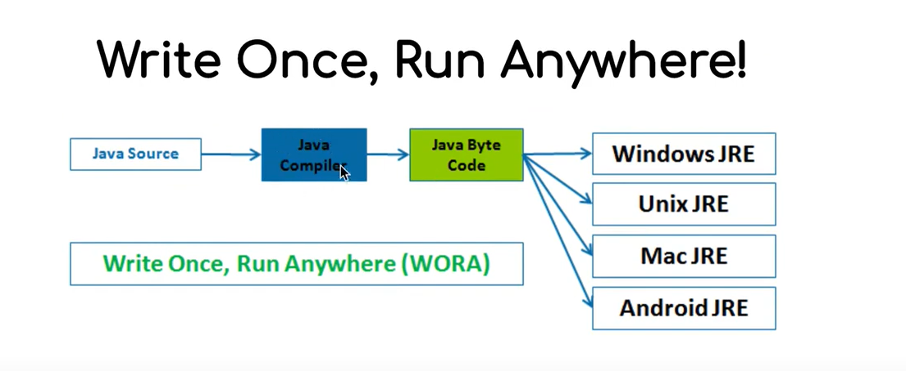
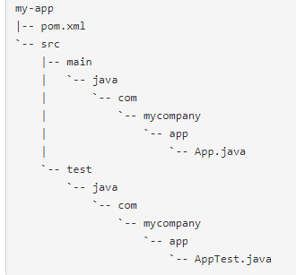

# Java

Tenemos el JDK y el Compiler, vease en java -version y javac -version

JDK - JAVA DEVELOPMENT KIT (la api de java)

Java es un lenguaje tipado, y todo su codigo y fundamentos parten de las clases. El programa se arrancara mediante una clase
y ejecutara el metodo `main`.

Muy importante llamar el fichero y la clase que contiene IGUAL

En comvertiremos el codigo fuente en bitecode, gracias al Java compiler. El binarycode es iterpretado por el JDK, la maquina virtual.



ejecutamos en la consola `javac ./HelloWorld.java` y nos generara un fichero llamado `HelloWorld.class` con el codigo binario.

Finalmente, para ejecutar dicho binario, ejecutaremos `java HelloWorld`. Esto buscara la classe compilada en `Class Loader System`

Como podemos ver, el metodo main acepta unos String [] args. Estos son los argumentos que aceptan a la hora de ejecutar dicha clase.

```java

class Hello {
  public static void main(String[] args) {
    System.out.println("com.helloprintln.Hello, " + args[0] + '!');
  }
}

```

> $ javac com.helloprintln.Hello.java
>
> $ java com.helloprintln.Hello pepito
>
> com.helloprintln.Hello, pepito!

En java todo se estructura mediante paquetes

Todo extiende de Object, como en JavaScripts

Una clase estatica es esa que no se isntancia, como por ejemplo, una clase que sea como una Utilidad.

Protected se usa cuando solo queremos usar esa clase dentro del mismo paquete

JEE (Java Enterprice Edition) - para ejecutar servidor, tiene JRE y mas cosas, mas Java Apis

JRE (Java Runetime Edition) - ejecutar codigo a nivel cliente

Swing components - para crear una vista en Java

## Build System

.jar => pacquetes

Maven y Grandle son Build systems, encargados de añadirte paquetes a tu proyecto, los cuales podras usar

### Classpath

La forma mas pura de añadir paquetes. Modificando el destino de las classes que quieres usar?

[example here](https://stackoverflow.com/questions/19330832/setting-up-junit-with-intellij-idea)

### Maven

Maven is essentially a project management and comprehension tool.

Instalacion de Maven, seguir [estos pasos](https://howtodoinjava.com/maven/how-to-install-maven-on-windows/)

> mvn -version

Maven utiliza un Project Object Model (POM) para describir el proyecto de software a construir, sus dependencias de otros módulos y componentes externos, y el orden de construcción de los elementos. Viene con objetivos predefinidos para realizar ciertas tareas claramente definidas, como la compilación del código y su empaquetado.

Leer el [Maven gettingstart](https://maven.apache.org/guides/getting-started/)

Para crear un proyecto con Maven, ejecuta este comando.

> mvn -B archetype:generate -DgroupId=com.mycompany.app -DartifactId=my-app -DarchetypeArtifactId=maven-archetype-quickstart -DarchetypeVersion=1.4

Esto nos generara una carpeta llamada `my-app`, con un fichero llamado `pom.xml`.

`pom.xml` contains the Project Object Model (POM) for this project.

para ver mas sobre [POM](https://maven.apache.org/guides/introduction/introduction-to-the-pom.html)

Este fichero contiene la informacion del proyecto, las depencencias, y la configuracion del build

#### Maven POM.XML

- `project` This is the top-level element in all Maven pom.xml files.
- `modelVersion` This element indicates what version of the object model this POM is using. The version of the model itself changes very infrequently but it is mandatory in order to ensure stability of use if and when the Maven developers deem it necessary to change the model.
- `groupId` This element indicates the unique identifier of the organization or group that created the project. The groupId is one of the key identifiers of a project and is typically based on the fully qualified domain name of your organization. For example org.apache.maven.plugins is the designated groupId for all Maven plugins. -`artifactId` This element indicates the unique base name of the primary artifact being generated by this project. The primary artifact for a project is typically a JAR file. Secondary artifacts like source bundles also use the artifactId as part of their final name. A typical artifact produced by Maven would have the form <artifactId>-<version>.<extension> (for example, myapp-1.0.jar).
- `version` This element indicates the version of the artifact generated by the project. Maven goes a long way to help you with version management and you will often see the SNAPSHOT designator in a version, which indicates that a project is in a state of development. We will discuss the use of snapshots and how they work further on in this guide.
- `name` This element indicates the display name used for the project. This is often used in Maven's generated documentation.
- `url` This element indicates where the project's site can be found. This is often used in Maven's generated documentation.
- `properties` This element contains value placeholders accessible anywhere within a POM.
- `dependencies` This element's children list dependencies. The cornerstone of the POM.
- `build` This element handles things like declaring your project's directory structure and managing plugins.

#### Folder Structure



As you can see, the project created from the archetype has a POM, a source tree for your application's sources and a source tree for your test sources. This is the standard layout for Maven projects (the application sources reside in ${basedir}/src/main/java and test sources reside in ${basedir}/src/test/java, where ${basedir} represents the directory containing pom.xml).

#### Commands

> mvn compile #only compile code

> mvn test #compile and execute tests

> mvn test-compile #only compile and not execute

#### Gitignore

```text
target/
pom.xml.tag
pom.xml.releaseBackup
pom.xml.versionsBackup
pom.xml.next
release.properties
dependency-reduced-pom.xml
buildNumber.properties
.mvn/timing.properties
# https://github.com/takari/maven-wrapper#usage-without-binary-jar
.mvn/wrapper/maven-wrapper.jar
```

#### POM.xml - Maven

By default, if you want to execute compilation, the directory structure must be:

`src/main/java` as a source folder.

`src/test/java` as a test folder.

could be change it by this conf.

```xml

<project>
    ...
    <build>
        <sourceDirectory>src</sourceDirectory>
        <testSourceDirectory>test</testSourceDirectory>
    </build>
    ...
</project>

```

#### Jacoco config

This package is used to show your code coverage of your tests.
just type this configuration on your pom.xml inside `<plugins></plugins>` tag

```xml
 <plugin>
        <groupId>org.jacoco</groupId>
        <artifactId>jacoco-maven-plugin</artifactId>
        <version>0.8.6</version>
        <executions>
          <execution>
            <goals>
              <goal>prepare-agent</goal>
            </goals>

          </execution>
          <!-- attached to Maven test phase -->
          <execution>
            <id>report</id>
            <phase>test</phase>
            <goals>
              <goal>report</goal>
            </goals>
          </execution>
        </executions>
      </plugin>
```
