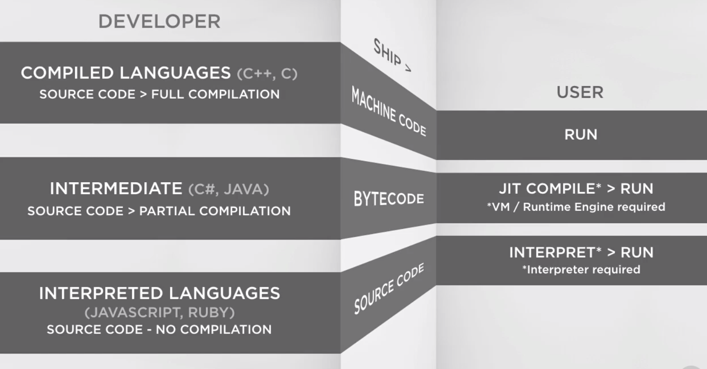

# All My Note

## [Java](https://github.com/VGamezz19/my-coding-notes/tree/master/Java)

## [JavaScript-fundamentos](https://github.com/VGamezz19/my-coding-notes/tree/master/JavaScript-fundamentos) [✔︎]

## [JavaScript-avanzado](https://github.com/VGamezz19/my-coding-notes/tree/master/JavaScript-Avanzado) [✔︎]

## [About test](https://github.com/VGamezz19/my-coding-notes/blob/master/test.md)

## [NodeJS](https://github.com/VGamezz19/my-coding-notes/tree/master/NodeJs)

## [Deno](https://github.com/VGamezz19/my-coding-notes/tree/master/Deno)

## [React](https://github.com/VGamezz19/my-coding-notes/tree/master/React) [✔︎]

## [ReactNative](https://github.com/VGamezz19/my-coding-notes/tree/master/ReactNative) [✔︎]

## [WebPack](https://github.com/VGamezz19/my-coding-notes/tree/master/WebPack)

## [VueJS](https://github.com/VGamezz19/my-coding-notes/tree/master/Vue) [✔︎]

## [Flex](https://github.com/VGamezz19/my-coding-notes/tree/master/flex)

## [Dokcer](https://github.com/VGamezz19/my-coding-notes/tree/master/docker) [✔︎]

## [Jenkins](https://github.com/VGamezz19/my-coding-notes/tree/master/Jenkins)

## [Swift](https://github.com/VGamezz19/my-coding-notes/tree/master/Swift)

## [GIT](https://github.com/VGamezz19/my-coding-notes/blob/master/git.md)[✔︎]

## [VSCODE](https://github.com/VGamezz19/my-coding-notes/blob/master/vscode.md)[✔︎]

---

## About languages

---

## Interesting Posts

### Legend

1. Read (📄)
1. Watch (🎥)
1. Listen (🎼)

[MAX - study path](https://github.com/joebew42/study-path)

### Knowledge

- [^^/^^/2018 - (📄) TDD - Codurance](https://codurance.com/2018/06/17/frontend-outside-in/)

- [13/09/2018 - (📄) Agile - XP (by Kent Beck)](https://martinfowler.com/bliki/ExtremeProgramming.html)

- [13/09/2018 - (📄 \*\*) TDD (by Kent Beck)](https://martinfowler.com/bliki/TestDrivenDevelopment.html)

- [^^/^^/2018 - (📄) Double Test (Moks, Spies, Dummies, Fakes, Stubs)](http://techdencias.net/2014/12/29/double-tests-dummies-mocks-spies-fakes-y-stubs-en-javascript/)

- [^^/^^/2018 - (📄) xUnit Patterns - Test Double](http://xunitpatterns.com/Test%20Double%20Patterns.html)

- [^^/^^/2018 - (📄) Object - Calisthenics](https://williamdurand.fr/2013/06/03/object-calisthenics/)

- [13/09/2018 - (📄) Refactoring](https://refactoring.com/)

- [^^/^^/2018 - (📄) Pattern - GameLoop](http://gameprogrammingpatterns.com/game-loop.html)

- [^^/^^/2018 - (📄) Plain - Docker-NetCore](https://github.com/PlainConcepts/NetCore-Docker-Workshop)

- [17/01/2019 - (📄) API - Best practices RESTUL API](https://blog.mwaysolutions.com/2014/06/05/10-best-practices-for-better-restful-api/)

- [30/04/2019 - (📄) NODE - NPX between NPM](https://stackoverflow.com/questions/50605219/difference-between-npx-and-npm)

### C

- [^^/^^/20^^ - (📄) C# - Delegates](http://www.leomicheloni.com/post/2019/01/13/Delegate-predicate-Action-Func-metodos-anonimos-explicados-para-mortales)

- [^^/^^/20^^ - (📄) C# - Extension Methods](https://docs.microsoft.com/es-es/dotnet/csharp/programming-guide/classes-and-structs/extension-methods)

### JavaScript

- [20/06/2018 - (📄) JavaScript - Console API](https://medium.freecodecamp.org/working-with-the-devtools-console-and-console-api-an-overview-13cff6dc3db4)

- [17/01/2018 - (📄) JavaScript - Pensar asyncronamente](https://medium.com/@ulisesGascon/pensar-as%C3%ADncronamente-en-un-mundo-s%C3%ADncrono-8e25cfcafd83)

- [02/08/2018 - (📄) JavaScript - Object.assing deep copy](https://medium.com/@tkssharma/objects-in-javascript-object-assign-deep-copy-64106c9aefab)

- [04/08/2018 - (📄) JavaScript - S-O-L-I-D - basic](https://medium.com/@cramirez92/s-o-l-i-d-the-first-5-priciples-of-object-oriented-design-with-javascript-790f6ac9b9fa)

- [04/04/2018 - (📄) JavaScript - S-O-L-I-D - Dor Tzur](https://thefullstack.xyz/solid-javascript/)

- [^^/^^/2018 - (📄) JavaScript - Factory Function vs Constructor Function vs Clasess](https://medium.com/javascript-scene/javascript-factory-functions-vs-constructor-functions-vs-classes-2f22ceddf33e)

- [0609 /2018 - (🎥) JavaScript - Clean Code: SOLID](https://www.youtube.com/watch?v=XzdhzyAukMM)

- [^^/^^/2018 - (📄) JavaScript - Object Composition](https://medium.com/code-monkey/object-composition-in-javascript-2f9b9077b5e6)

- [^^/^^/2018 - (📄) JavaScript - Clean Code JS](https://github.com/ryanmcdermott/clean-code-javascript)

- [^^/^^/2018 - (📄) JavaScript - 33 js concepts](https://github.com/leonardomso/33-js-concepts)

### ES6

- [12/06/2018 - (📄) ES6 - Hipster Hack - Spread Operator](https://hackernoon.com/javascript-hacks-for-es6-hipsters-67d633ce8ace)

- [13/06/2018 - (📄) ES6 - Symbols](http://exploringjs.com/es6/ch_symbols.html)

- [18/06/2018 - (📄) ES6 - Write lees, do more](https://medium.freecodecamp.org/write-less-do-more-with-javascript-es6-5fd4a8e50ee2)

- [16/07/2018 - (📄) ES6 - JavaScript Symbols, Iterators, Generators, Async/Await, and Async Iterators](https://medium.freecodecamp.org/some-of-javascripts-most-useful-features-can-be-tricky-let-me-explain-them-4003d7bbed32)

- [^^/^^/2018 - (📄) ES6 - Transform Class Properties](https://medium.com/@jacobworrel/babels-transform-class-properties-plugin-how-it-works-and-what-it-means-for-your-react-apps-6983539ffc22)

- [^^/^^/2018 - (📄) ES6 - Transform Class Properties not be as great as we thing](https://medium.com/@charpeni/arrow-functions-in-class-properties-might-not-be-as-great-as-we-think-3b3551c440b1)

### ReactJS

- [20/06/2018 - (📄) React - Container pattern](https://medium.com/@learnreact/container-components-c0e67432e005)

- [20/06/2018 - (📄) React - Presentational and Container Components](https://medium.com/@dan_abramov/smart-and-dumb-components-7ca2f9a7c7d0)

- [^^/^^/2018 - (📄) React - Hooks](https://reactjs.org/docs/hooks-overview.html)

- [^^/^^/2018 - (📄) React - Render Props](https://reactjs.org/docs/render-props.html)

- [^^/^^/2018 - (📄) React - Higher order components](https://reactjs.org/docs/higher-order-components.html)

### Vue

- [18/06/2018 - (📄) Vue - Build Vue Components](https://blog.bitsrc.io/how-to-build-vue-components-like-a-pro-fd89fd4d524d)

- [30/07/2018 - (📄) Vue - Event Bus Pattern from Vue](https://alligator.io/vuejs/global-event-bus/)

- [^^/^^/2018 - (📄) VUEjs - Scoped Styles vs CSS Modules](https://www.netguru.co/codestories/vue.js-scoped-styles-vs-css-modules?utm_campaign=Codestories&utm_source=twitter&utm_medium=social)

### NodeJS

- [18/06/2018 - (📄) Node - About NodeJS](https://medium.freecodecamp.org/what-exactly-is-node-js-ae36e97449f5)

### Webpack

- [11/06/2018 - (📄) Webpack - The Confusing Parts](https://medium.com/@rajaraodv/webpack-the-confusing-parts-58712f8fcad9)

### GraphQL

- [^^/^^/2018 - GraphQL - about queries](https://medium.freecodecamp.org/graphql-front-end-queries-made-easy-68e9d9ded283)

### CSS Styles

- [^^/^^/2018 - (📄) BEM - Introduction](http://getbem.com/introduction/)

- [^^/^^/2018 - (📄) BEM - Bem Methodology](https://webdesign.tutsplus.com/es/articles/an-introduction-to-the-bem-methodology--cms-19403)

- [^^/^^/2018 - (📄) BEM - Estructura los componentes](http://blog.ckgrafico.com/tomando-decisiones-estructurar-los-componentes-css/)
