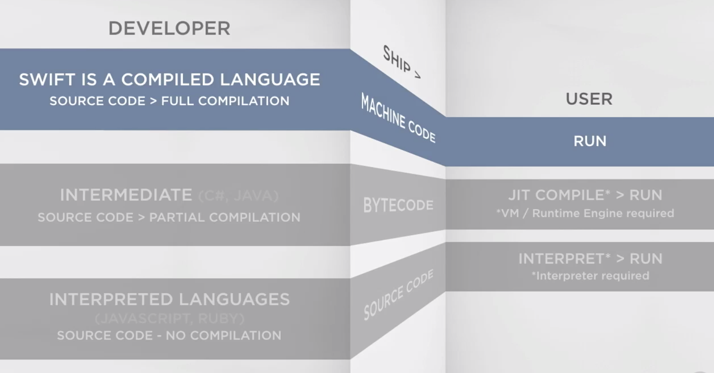
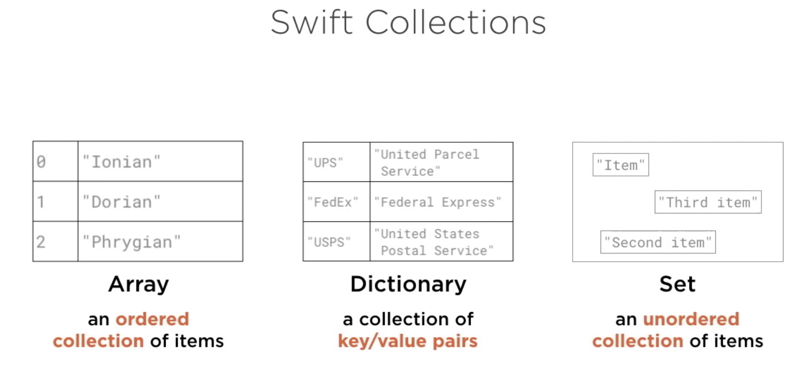

# Swift

Use REPL (Read Eval Print Loop) equals to NodeJs



`var` fro variables
`let` fro constants

you can define a constant, whenever you want, but only can ve fefined ones

## Optionals

in swift, as a muchs of other languages, we can define an optional values. by puting de question mark at the end of the Type.

`var optionalString: String?`

this will enable the posibiliti to convert `optionalStrin` variable into a `nil`.

`nil` is the key word to refeer to a null value, no false, not empty string nor cero. is nil.

then, if we want to use this variable, for making sure that there is a value, we need to unwrapp de variable, the value. There is two ways for make it possible.

1

```swift
var optionalString: String?

optionalString = 100

if optionalString != nil {
    var unwrappedOptional = optionalString!

    unwrappedOptional += 10
    print(unwrappedOptional)
}
```

2

```swift
var optionalString: String?

optionalString = 100

if let unwrappedOptional = optionalString {
    unwrappedOptional += 10
    print(unwrappedOptional)
}
```

## Collections



## Switch

```Swift

let volcanoExplosivityIndex: Int // Could be 0 to 8
let rangeDangerVolcanoExplosivity: ClosedRange<Int> = 4 ... 8

let eee: [Int] = Array(4 ... 8) //ClosedRanged.

volcanoExplosivityIndex = 6

switch volcanoExplosivityIndex {
case 0:
    print("Effusive")
case 1:
    print("explosive")
case 2:
    print("anal")
case 3:
    print("rape")
case rangeDangerVolcanoExplosivity: //Range of values
    print("exaust the rest 4, 5, 6, 7, 8")
default:
    print("Not a recognized index.")
}

```

## Strides

```Swift
newChapter(title: "Strides Loops")

for number in stride(from: 0, through: 256, by: 16) {
    // This will print, by 16 from 0 to 256
    print(number)
}

for number in stride(from: 0, to: 256, by: 16) {
    // This will print, by 16 from 0 to 240, avoiding the lasts 16 numbers
    print(number)
}

for number in stride(from: 256, through: 0, by: -16) {
    // Descendent
    print(number)
}

```

## String interpolation

```Swift
let trackName = "Amber"
let artistName = "Stick to Your Guns"
let duration = 200

let message = "Now playing \(trackName) by \(artistName) wich is \(duration) long"

print(message)


```

## Func

```Swift
// Func
newChapter(title: "Functions")

func showMessage(number: Int, name: String) { // Are inmutable values
    //You can't modify the parameters
    print("The function call worked \(number) and the string: \(name)")
}

showMessage(number: 24, name: "Douglas")

func basicFunction() -> String {
    let str = "This is a simple function."
    return str
}

let result = basicFunction()

// For ignore what the funcion is returning
_ = basicFunction()

// Avoid namin the parameter of a function, adding _
func printUserName(_ name: String, _ lastName: String) -> Void {
    print(name, lastName)
}

printUserName("Victor", "Gamez")

// Changing the name of parameters.
// (Int, Int) -> Int
func difference(between firstAmount: Int, and secondAmount: Int) -> Int {
    if firstAmount > secondAmount {
        return firstAmount - secondAmount
    } else {
        return secondAmount - firstAmount
    }
}

var res = difference(between: 2000, and: 1500)

print("The difference is: \(res)")
```

## Naming functions

```Swift
// BAD NAMING
func showMessage(message: String){ ... }
showMessage(message: "Hola")

// GOOD NAMING
func show(message: String)
show(message:"hola")

//Native from Swift
var hola: String
Type(of: hola) // String

func show(message: String) -> Void {
    print(message)
}

func show(number: Int) -> Void {
    print(number)
}

func show(message: String, number: Int) -> Void {
    print("\(message) \(number)")
}

show(message: "Hola que tal, show message")
show(number: 200)
show(message: "showing", number: 200)
```

## Enumerable

```Swift
//Enumeration
newChapter(title: "enumeration")

enum MediaType {
    case book
    case movie
    case music
    case game
}

var itemType: MediaType

itemType = MediaType.book

//later
itemType = MediaType.movie

// you can do that.
itemType = .music

// Raw Values
// Especifict default value for each enum
enum DefaultValue: String {
    case hola = "Hola"
    case que = "Que"
    case tal = "Tal"
}

var defaultValueQuetal: DefaultValue = .hola

switch defaultValueQuetal {
case .hola, .que, .tal:
    print("Default Vale in type \(defaultValueQuetal) there is as a default \(defaultValueQuetal.rawValue)")
}

// Associated Values in enumerables
enum Object {
    case movie(String)
    case music(Int)
    case book(String)
}

var items: [Object] = [.movie("Comedy"), .music(120), .book("Hobbit")]

for item in items {
    switch item {
    case .movie(let genre):
        print("The movie is of genre \(genre)")
    case .music(let bpm):
        print("the track is long \(bpm)s")
    case .book(let title):
        print("The best book ever is \(title)")
    }
}

```

## Dictionaries

```swift
// dictonaries
newChapter(title: "Dictonaries")

//Key | Values
var airlines = ["SWA": "Southwest Airlines",
                "XUM": "North Blums",
                "PGB": "German Paralx",
                "BAW": "British Airways"]
// var airlines:[String: String]

print(airlines)
var air = airlines["SWA"]
print(air)

// All the values in a dictionari are optional, because, could be that the key dosen't exist in the dictionary...

if let a = airlines["SWA"] {
    print(a)
}

// Add new
airlines["CIC"] = "CICUTA"

print(airlines)

// Remove
airlines["SWA"] = nil
print(airlines)

// loops
// (key, value)
for (code, airline) in airlines {
    print(airline)
}
```

## Tuple

```Swift
// Tuples
newChapter(title: "Tuples")

// The tuples are values wrapeds between parentesis.
// Naming what are you returning

func randomAlbum() -> (albumTitle: String, albumDuration: Int) {
    let title = "Lord of the rings"
    let duration = 2546

    return (title, duration)
}

let rAlbum = randomAlbum()
print(rAlbum)

print(rAlbum.albumTitle)
print(rAlbum.albumDuration)

// like spread operator
let (titAlbum, dudAlbum) = randomAlbum()

print("\(titAlbum) \(dudAlbum)")
```

## Clousure

```Swift
newChapter(title: "Clousures")

struct Book {
    var title: String;
    var authorName: String;
    var readingAge: Int;
    var pageCount: Int;
}

var book1 = Book.init(title: "foo", authorName: "Victor", readingAge: 16, pageCount: 200)
var book2 = Book.init(title: "baar", authorName: "And", readingAge: 8, pageCount: 234)
var book3 = Book.init(title: "ble", authorName: "Ju", readingAge: 5, pageCount: 433)

var allBooks = [book1, book2, book3];

//func orderName(book1: Book, book2: Book) -> Bool {
//    return book1.authorName >= book2.authorName;
//}
//
//print(allBooks.sorted(by: orderName)); // Vic, Ju, And

var nameSortedBooks = allBooks.sorted(by: {
    (firstBook: Book, secondBook: Book) -> Bool
    in
    return firstBook.authorName >= secondBook.authorName
})

print(nameSortedBooks) // Vic, Ju, And


var nameSortedBookWell = allBooks.sorted { $0.authorName >= $1.authorName }// Vic, Ju, And

print(nameSortedBookWell)
```

## Class

```Swift
newChapter(title: "Class")

class Appliance {
    var manufacture: String;
    var model: String;
    var voltage: Int;
    var capacity: Int?;

    init(initVoltage: Int) {
        self.voltage = initVoltage;
        self.manufacture = "Default value"
        self.model = "Default value"
    }

    deinit {
        // Deinisialazion of the class...
        // On for classe, not alow for structs
        /*
         It's not required that you implement that method,
         but you can use it if you need to do some action
         or cleanup before deallocating the object.
         */
    }

    func getDetails() -> String {
        var message = "This is hte \(self.model) from \(self.manufacture)"
        if (self.voltage >= 200) {
            message += " This model is for Europeans usage"
        }

        return message
    }
}

var kettle = Appliance(initVoltage: 230)

print(kettle.getDetails())
```

## Differents between Struct and Class+

```Swift
newChapter(title: "Differents between class and struct")

// STRUCT ------
struct MessageStruct{
    var text = "Initial Message"
}

var instOfMessageStruct1 = MessageStruct()
instOfMessageStruct1.text = "Clossing Message Struct" // Works

let instOfMessageStruct2 = MessageStruct()
//instOfMessageStruct2.text = "Closing Message Struct" // Fails

// Because, we instanciate de struct as a constant (let)
// and you are not able to modify it

// CLASS -----
class MessageClass{
    var text = "Initial Message Class"
}

var instOfMessageClass1 = MessageClass()
instOfMessageClass1.text = "Clossing Message Class" // Works

let instOfMessageClass2 = MessageClass()
instOfMessageClass2.text = "Classing Message Class" // Works
// Because, we define ms as a VAR and not as a Const (let)

// STRUCTS ----

struct InMutableStruct {
    var mutable = "Could be Mutable?"
}

var inMutableStruct1 = InMutableStruct()
var inMutableStruct2 = inMutableStruct1

inMutableStruct2.mutable = "I don't think so"

print(inMutableStruct1.mutable) // Could be Mutable?
print(inMutableStruct2.mutable) // I don't think so

// CLASS ----
print("")

class MutableCalss {
    var mutable = "Could be Mutable?"
}

var mutableClass1 = MutableCalss()
var mutableClass2 = mutableClass1

mutableClass1.mutable = "yes! sure"

print(mutableClass1.mutable) // yes! sure
print(mutableClass2.mutable) // yes! sure
```

## Inheritance

```Swift
newChapter(title: "inheritance")

enum AnimalType {
    case mamifero
    case oviparo
    case alien
}

// SUPER CLASS
class Animal {
    var type: AnimalType;
    var name: String;
    var limbs: Int?;

    init(type: AnimalType, name: String) {
        self.type = type
        self.name = name
    }

    // This COULD NOT be overritend
    final func getDetails() -> String {
        return "This animal is type of \(self.type) and specimen \(self.name)"
    }
}

// SUB CLASS
class Cat: Animal {
    var sound: String;

    init() {
        self.sound = "MEEEWW"
        super.init(type: AnimalType.mamifero, name: "Cat")
    }

    func soundAction() -> String{
        return "The \(super.name) sounds like: \(self.sound)"
    }
}

var myCat = Cat()

print(myCat.soundAction()) // he Cat sounds like: MEEEWW
print(myCat.getDetails()) //  This animal is type of mamifero and specimen Cat
```

## Extension

```Swift
newChapter(title: "Extension")

extension String {
    func without(rule: Character) -> String {
        return self.filter { $0 != rule }
    }
}

var completName = "Victor Gamez Royo"
print(completName)
print(completName.without(rule: " ")) // "VictorGamezRoyo"

```

## Computed Values

```Swift
newChapter(title: "Computed values")

class Player {
    var name: String
    var livesRemaining: Int
    var enemiesDestroyed: Int
    var penalty: Int
    var bonus: Int

//    var score: Int {
//        get {
//            return (enemiesDestroyed * 1000) + bonus + (livesRemaining * 5000) - penalty
//        }
//    }
    // OR
    // This Computed properti will be only ReadOnly. we don't defined a SET method.
    // Computed properties are not abailables as a constant. That is, becouse
    // the value will be in constantly changing.
    var score: Int {
        return (enemiesDestroyed * 1000) + bonus + (livesRemaining * 5000) - penalty
    }

    init(name: String) {
        self.name = name
        self.livesRemaining = 3
        self.enemiesDestroyed = 0
        self.penalty = 0
        self.bonus = 0
    }
}

let newPlayer = Player(name: "VGamez")
print(newPlayer.score)
```
